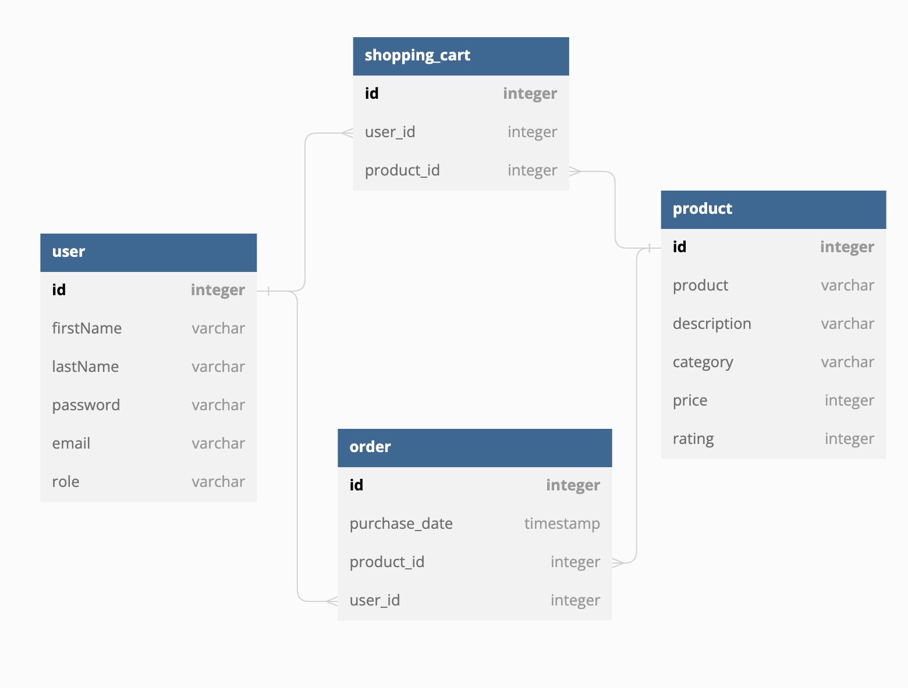

# Data Structure

The data structure is as below where shopping_cart and order are both 
join tables where the User can have a single "shopping cart" and a table of orders
so both JoinTables will have full access to the related User / Product object.

DBML:
Table user {
id integer [primary key]
firstName varchar
lastName varchar
password varchar
email varchar
role varchar
}

TABLE order {
id integer [primary key]
purchase_date timestamp
product_id integer
user_id integer
}

Table product {
id integer [primary key]
product varchar
description varchar
category varchar
price integer
rating integer
}

TABLE shopping_cart {
id integer [primary key]
user_id integer
product_id integer
}

Ref: order.product_id > product.id
Ref: order.user_id > user.id
Ref: shopping_cart.user_id > user.id
Ref: shopping_cart.product_id > product.id